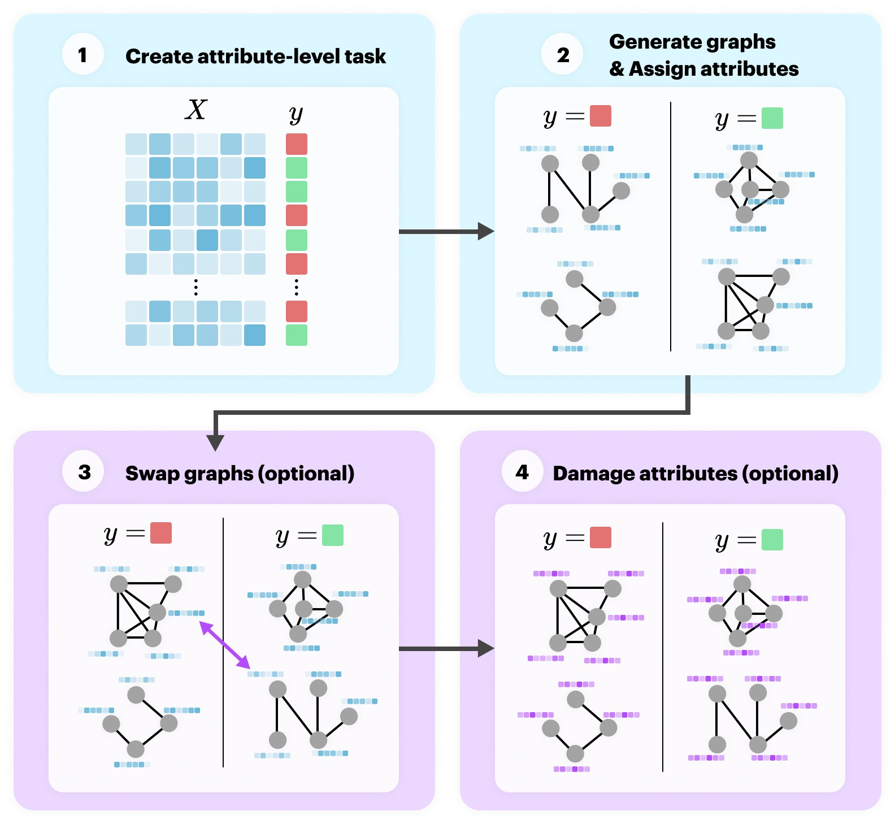

# Graph Classification Experiments 💡

This directory contains the code for both the real-world and synthetic graph classification experiments in the respective subfolders.

## Real-World Data 🍄

Experiments are run on various pretrainings using real-world _molecular property prediction_ datasets from [Open Graph Benchmark](https://ogb.stanford.edu). 

The experiment runs can be found [here](https://www.comet.ml/graph-net-experiments/graph-classification).

## Synthetic Data 🗿

Experiments are run on generated datasets with community structure. A custom generator is written to create the datasets:

The experiment runs can be found [here](https://www.comet.ml/graph-net-experiments/graph-classification-synthetic).
