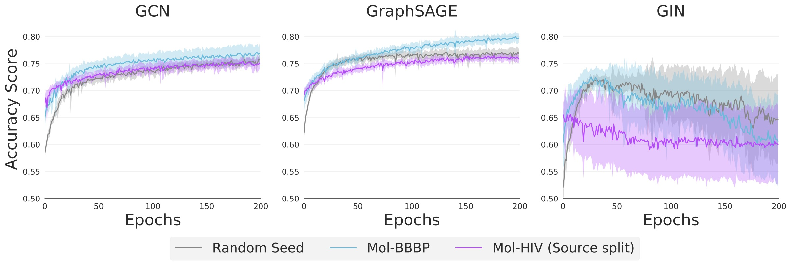

# Graph Classification: Real-World Data 🎯
This directory contains all the code for the real-world graph classification experiments.



The experiment runs can be found [here](https://www.comet.ml/graph-net-experiments/graph-classification).

## Datasets 🧩

We use two molecular property prediction datasets from _Open Graph Benchmark_: [BBBP and HIV](https://ogb.stanford.edu/docs/graphprop/#ogbg-mol).

## Experiments 🔬
We perform five sets of transfer learning experiments:

| *#* | *Source Task*                            | *Runtime argument*                |
| --- | -----------------------------------------| --------------------------------- |
| *1* | None                                     | `base`                            |
| *2* | BBBP                                     | `transfer`                        |
| *3* | BBBP [Damaged features]                  | `transfer-damaged`                |
| *4* | HIV _(Source split)_                     | `self-transfer`                   |
| *5* | HIV _(Source split)_ [Damaged features]  | `self-transfer-damaged`           |

## Running experiments🏃🏽‍♀️

Running the script `run.py` will run a batch of experiments.

Example:

```shell
  $ python run.py --model="sage" --type="transfer" --runs=5 --epochs=300 --lr=0.1 --hidden_dim=100 --num_layers=3
```

The following parameters may be passed to the script when executed.
* `model`
  * The GNN to use.
  * Options: `'gcn'`, `'sage'`, `'gin'`
  * Default: `'gcn'`
  
* `type`
  * The experiment type. 
  * Options: Any of the five specified in the table above under the _Runtime argument_ column.
  * Default: `'base'`
  
* `runs`
  * The number of experiments to run. 
  * Options: Any natural number
  * Default: `10`
  
* `epochs`
  * The number of epochs to run for.
  * Options: Any natural number
  * Default: `200`
  
* `lr`
  * The learning rate to use.
  * Options: A float between 0 and 1.
  * Default: `0.001`
  
* `hidden_dim`
  * The hidden dimensionality of the GNN network.
  * Options: A natural number.
  * Default: `300`

* `num_layers`
  * The number of GNN layers in the network.
  * Options: Any natural number
  * Default: `5`
