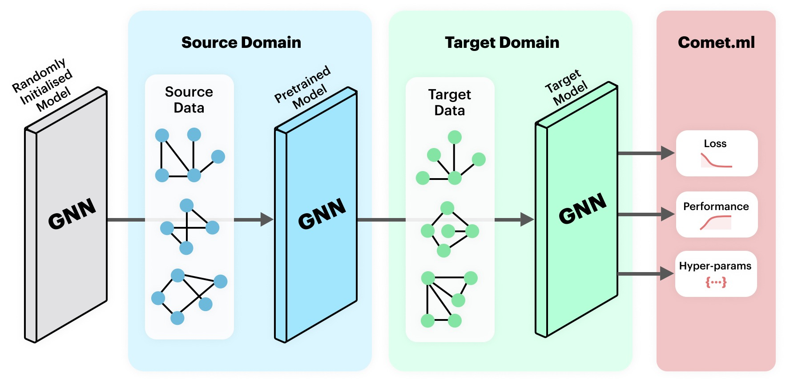

# GNN Transfer Learning 🎡

This repository contains all my code for my MSc Dissertation at Wits University titled:

__How does relational knowledge generalise? An analysis of transfer learning for graph neural networks__.



## Repo structure 🧑🏾‍💻
```
root
│
└─── Node Classification
│    └─── Real World Data
│       │ *
│    └─── Synthetic Data
│       │ *
│   
└─── Graph Classification
     └─── Real World Data
        │ *
     └─── Synthetic Data
        │ *
```

The repo consist of two contexts: __Node Classification__ & __Graph Classification__.

Each context contains a set of experiments of __Real World Data__ & __Synthetic Data__.

## Comet.ml ☄️

All the individual experimental runs can be found on the [comet.ml page](https://www.comet.ml/graph-net-experiments#projects).

Each experiment is tagged for easy filtering. When viewing the list of all experiments, grouping the experients by tags make browsing easier. To do this: click the _Group by_ button, then type "tags" and select it, then click _Done_. 👍🏽

## Requirements 🤘🏽
All the code is written in Python 3, and the following packages are required:

* `numpy`
* `networkx`
* `sklearn`
* `pandas`
* `torch`
* `torch_geometric` (This gets a bit messy to install. [See this for info on installation.](https://pytorch-geometric.readthedocs.io/en/latest/notes/installation.html) )
* `ogb`
* `comet_ml`

## Running the code 🏃🏽‍♂️
Each directory contains a `run.py` script which is all that needs to be run for every class of experiment. Details of the specific arguments can be found in the folder's `README`.

_Note: The scripts will not run without an API key provided to the Comet.ml project. To get the scripts to run, please comment out all the lines involving comet_ml._
